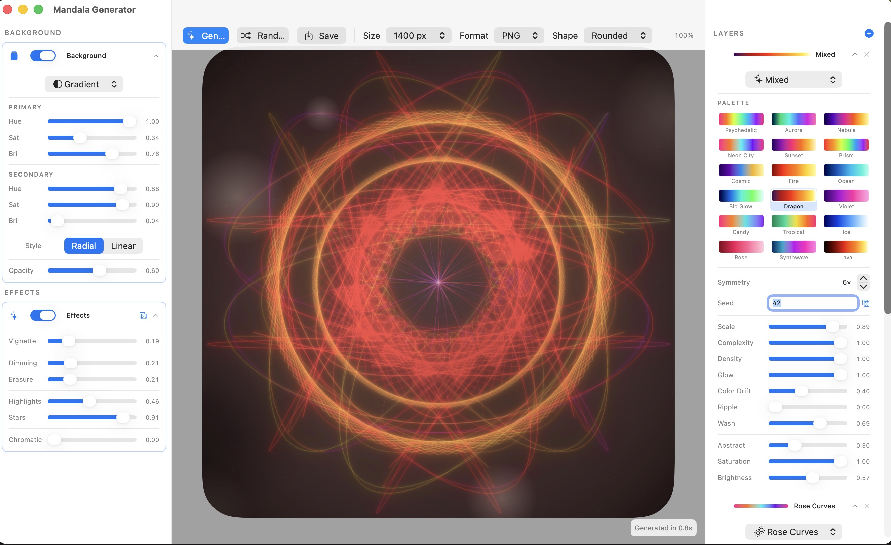
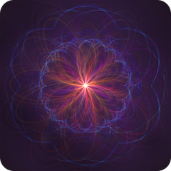
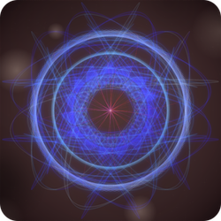
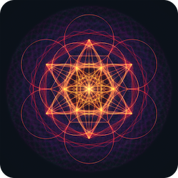
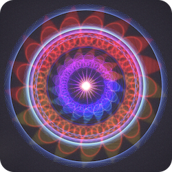
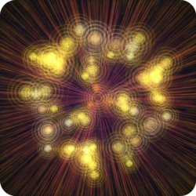
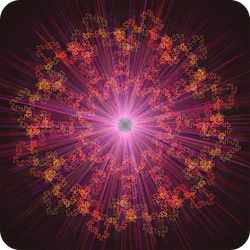
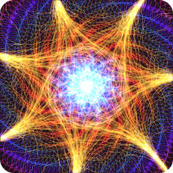
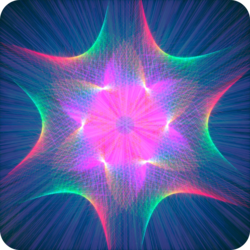
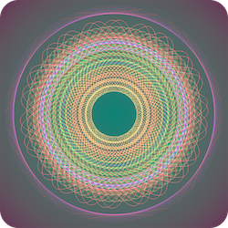

# Mandala Generator

A native macOS app for generating neon light-painting mandala images. Every parameter is controllable in real time, with instant auto-generation on change.

## Download

1. Go to the [latest release](https://github.com/morja/mandala-generator/releases/latest)
2. Download **Mandala-Generator.zip** and unzip it
3. Move **Mandala Generator.app** to your Applications folder
4. On first launch, right-click → **Open** to bypass Gatekeeper (the app is not notarised)

Requires macOS 14 or later.

---













Find more samples [here](samples/).

## Features

- **33 drawing styles** organised into five categories:
  - *Parametric Curves* — Spirograph, Rose Curves, Floral, Butterfly, Epitrochoid, Lissajous, Hypocycloid, Phyllotaxis, Fractal, Superformula, Wave Interference
  - *Geometric & Pattern* — Geometric, Sacred Geometry, Sunburst, Star Burst, String Art, Spider Web, Weave, Radial Mesh, Moiré
  - *Organic & Flow* — Flow Field, Tendril, Voronoi, **Strange Attractor** (Clifford / De Jong / Bedhead / Hopalong with 30 presets)
  - *3D* — **Hyperboloid** (ruled surface), **Torus** (parametric wireframe), **Nautilus Shell** (logarithmic spiral), Torus Knot, Sphere Grid, Tesseract
  - *Special* — Universe, Symbols, Mixed
- **3D styles** — Hyperboloid, Torus, and Nautilus Shell are rendered as tilted wireframe / spiral projections with depth shading (front faces bright, back faces dim at 8%) and per-symmetry brightness normalisation to prevent centre overexposure at high symmetry counts
- **Strange Attractor style** — 30 presets across four attractor types; 500 k–1 M iterated points; colour LUT for performance; scale adapts to attractor bounds
- **Superformula style** — 22 Gielis presets spanning sharp stars through smooth polygons; density-driven stroke weight
- **Universe style** — density drives a 7-level cosmic progression: single planet → two planets → Saturn with rings → full solar system → Milky Way spiral galaxy → multiple galaxies → cosmic web with filaments and galaxy clusters; fully symmetry-aware
- **Symbols style** — 20 sacred and universal symbols arranged in mandala rings: Heart, Peace, Infinity, Eye of Providence, Yin-Yang, Crescent, Star of David, Pentagram, Ankh, Om, Chakra Lotus, Flower of Life, Dharma Wheel, Merkaba, Triquetra, Ouroboros, Triskelion, Vesica Piscis, Hamsa, Sri Yantra, Eye of Horus, Star of Ishtar, Caduceus — seed-driven selection with concentric center symbol
- **Multi-layer compositing** — stack up to 5 independent layers, each with its own style, palette, blend mode, and settings
- **Per-layer controls** — symmetry, seed, scale, complexity, density, glow, colour drift, ripple, wash, abstract level, saturation, brightness, rotation, opacity, blend mode
- **Layer header actions** — dice (randomize), duplicate, copy/paste via context menu; drag handle for reordering
- **Layer mini-previews** — each layer card shows a live thumbnail that updates after every render
- **Drag-to-reorder layers** — drag handle on each layer card; sticky "Add Layer" button always visible at the top
- **Favorites** — save any render as a favourite (★ button in the toolbar); browse, apply, and delete favourites from a popover thumbnail grid; favourites persist across sessions
- **Copy to clipboard** (⌘⇧C) — copies the current image as PNG to the system clipboard; also available in the Edit menu
- **Background layer** — solid colour (exact RGB, independent of layer blend modes), gradient (radial or linear), pattern (checkerboard, stripes, diagonal, crosshatch), grain, image, or **Auto** (palette-derived dark ambient gradient)
- **Solid colour background** — bypasses the filmic tone-map so the displayed colour exactly matches the HSB picker; composited after all layers so Add/Screen blend modes between layers never pollute the background
- **Hue colour sliders** — background hue controls show a rainbow gradient track so you can see what colour you're picking
- **Effects layer** — brightness, contrast, vignette, chromatic aberration, 3D relief, dimming, erasure, highlights, star sparkles, **wash** (bleached/overexposed), **sepia** (warm antique), **fade** (matte gray), **bloom** (multi-scale glow bleed), **local contrast** (clarity / unsharp mask), **grain** (film noise), **glitter** (rainbow iridescent sparkles) — each spatial effect with independent seed dice button
- **18 colour palettes** — Aurora, Nebula, Neon City, Sunset, Prism, Bioluminescence, Blue/Red, Synthwave, Lava, Gold, Toxic, and more
- **Custom palette editor** — create, name, and save your own palettes with a gradient stop editor (HSB sliders per stop); custom palettes are marked with a star and persist across sessions
- **Resolution-independent brightness** — rendered at any preview or export resolution (512–8192 px), images always match in perceived brightness; the Float32 additive buffer is scaled by `bufferSize / 1600` before filmic tone-mapping so line energy density is constant across resolutions
- **Persistent history** — back/forward navigation (⌘[ / ⌘]) through every render, survives app restarts
- **Randomize All** (⌘⇧R) — generates a completely new random mandala; app starts with a random mandala on first launch
- **Save/Load settings** — save full parameter state as JSON (⌘S), load it back (⌘O); backward-compatible with older saves
- **Export** — PNG, JPG, or WebP at 512 / 800 / 1024 / 1400 / 2048 px or a custom size, with square / circle / squircle / rounded output shapes (PNG and WebP support transparency)
- **Batch export** (⌘⇧E) — render many seed/palette variations in parallel to a folder
- **Animated export** (⌘⌥E) — export a looping MOV (HEVC) or GIF with rotating layers; configurable frame count, FPS, and format; non-blocking with a live progress bar; background expanded so corners never appear during rotation
- **Pan & zoom** — scroll to zoom, drag to pan the canvas preview
- **Drawing layer** — draw symmetrical freehand strokes directly on the canvas; each stroke has its own color (color picker), weight, glow, blend mode, and symmetry
- **Graffiti / spray layer** — paint soft airbrush strokes below the drawing layer; configurable brush size, opacity, and softness for smooth blended areas

## Building

Requires Xcode command-line tools and Swift 5.9+.

```bash
swift build -c release
./build_app.sh
open "Mandala Generator.app"
```

### WebP Support

WebP export is not guaranteed to be available via macOS system frameworks (ImageIO WebP *read* support does not necessarily imply WebP *write* support).

To ensure reliable WebP export, install the `cwebp` tool via Homebrew:

```bash
brew install webp
```

The app detects WebP export support at runtime and only shows the WebP option when it can actually export WebP (either via ImageIO encoding support when available, or via `cwebp`). If WebP was previously selected but isn't supported on the current system, it automatically falls back to PNG.

## Interface

```
┌──────────────────────────────────────────────────────────────────────┐
│  Generate   Randomize All   Save Settings   Load   ←  →              │  ← toolbar
├────────────────┬───────────────────────────┬─────────────────────────┤
│  BACKGROUND    │                           │  LAYERS           [ + ] │  ← sticky
│  ┌──────────┐  │                           │  ⠿ ○ [img] Name  🎲 ⌄ × │
│  │ Base     │  │         Canvas            │  ┌───────────────────┐  │
│  │ Layer    │  │     (pan + zoom)          │  │  style / blend    │  │
│  └──────────┘  │                           │  │  palette grid     │  │
│  EFFECTS       │                           │  │  sliders…         │  │
│  ┌──────────┐  │                           │  └───────────────────┘  │
│  │ Effects  │  │                           │  ⠿ ○ [img] Name  🎲 ⌄ × │
│  └──────────┘  │                           │  └───────────────────┘  │
│  EXPORT        │                           │                         │
│  ┌──────────┐  │                           │                         │
│  │ Size/Fmt │  │                           │                         │
│  │ Save Img │  │                           │                         │
│  │ Animate  │  │                           │                         │
│  └──────────┘  │                           │                         │
└────────────────┴───────────────────────────┴─────────────────────────┘
```

### Keyboard Shortcuts

| Shortcut | Action |
|---|---|
| ⌘R | Generate / re-render |
| ⌘⇧R | Randomize all |
| ⌘S | Save settings |
| ⌘O | Load settings |
| ⌘⇧S | Save image |
| ⌘⇧C | Copy image to clipboard |
| ⌘⇧E | Batch export |
| ⌘⌥E | Export animation |
| ⌘[ / ⌘] | Navigate history back / forward |

### Background Panel (left)

Controls a dedicated background layer rendered before the mandala layers.

| Setting | Description |
|---|---|
| **Type** | Solid colour, gradient, pattern, grain, image, or Auto |
| **Color** | Exact solid fill — composited after all layers, immune to blend-mode interactions |
| **Auto** | Derives a dark ambient background from the first layer's palette |
| **Primary / Secondary** | Hue (colour gradient slider), saturation, brightness |
| **Gradient style** | Radial or linear (with angle control) |
| **Pattern type** | Checkerboard, stripes, diagonal, or crosshatch |
| **Opacity** | Overall background opacity |

### Effects Panel (left, below Background)

Post-processing applied to the final composite. Reset button restores all to defaults.

| Effect | Description |
|---|---|
| **Brightness** | Global brightness (0.5 = neutral) |
| **Contrast** | Global contrast (0.5 = neutral) |
| **Vignette** | Darkens the edges |
| **Chromatic** | RGB channel separation (chromatic aberration) |
| **Relief** | 3D emboss depth — hard-light blend of a directional height map |
| **Light** | Relief light direction (0–360°, shown when Relief > 0) |
| **Wash** | Bleached / washed-out look — desaturates and pushes colours toward white |
| **Sepia** | Warm antique sepia tone |
| **Fade** | Matte finish — fades toward flat neutral gray, reduces saturation and contrast |
| **Bloom** | Multi-scale soft glow bleed — bright areas melt into surrounding space across four radii |
| **Local Contrast** | Clarity / unsharp mask — boosts mid-range edge contrast without affecting global brightness |
| **Grain** | Analogue film grain / noise |
| **Dimming** | Random dark blotches (multiply blend) |
| **Erasure** | Burn-through holes in the image |
| **Highlights** | Additive glowing radial spots |
| **Stars** | Sharp cross-flare diffraction spike sparkles |
| **Glitter** | Dense iridescent rainbow sparkles — each a tiny coloured cross-flare; fully seeded |

Each spatially-random effect (Dimming, Erasure, Highlights, Stars, Glitter) has a dice button to reshuffle its position independently.

### Export Card (left, below Effects)

| Control | Description |
|---|---|
| **Size** | 512 / 800 / 1024 / 1400 / 2048 px, or Custom (any value 64–8192) |
| **Format** | PNG, JPG, or WebP (WebP only shown when supported) |
| **Shape** | Square, Circle, Squircle, or Rounded (PNG/WebP only — uses transparency) |
| **Save Image** (⌘⇧S) | Save the rendered image |
| **Export Animation…** (⌘⌥E) | Opens a dialog to choose format (MOV/GIF), frame count, and FPS, then exports a looping animation with a live progress bar |

### Layer Card (right)

Each layer is an independent drawing pass composited on top of previous layers. The sticky header at the top of the panel contains an **Add Layer** button.

#### Header actions

| Control | Description |
|---|---|
| **Drag handle** | Reorder layers by dragging |
| **Toggle** | Enable / disable the layer |
| **Thumbnail** | Live mini-preview, updates after each render |
| **Dice** (🎲) | Randomize all settings for this layer |
| **Duplicate** | Clone the layer with a new seed |
| **▲▼** | Collapse / expand the layer body |
| **×** | Delete the layer |
| **Right-click** | Copy / paste layer settings |

#### Layer parameters

| Parameter | Effect |
|---|---|
| **Style** | One of 33 drawing algorithms, grouped by category |
| **Blend Mode** | Screen (default), Add, Normal, or Multiply |
| **Symmetry** | Rotational repeat count (1–8) |
| **Seed** | RNG seed — change for a different arrangement |
| **Scale** | Radius of the pattern (0.1–1.0) |
| **Complexity** | Number / intricacy of curves |
| **Density** | Stroke weight and line count |
| **Glow** | Bloom/glow halo intensity |
| **Color Drift** | How far colours shift along the palette per curve |
| **Ripple** | Radial displacement noise |
| **Wash** | Watercolour bleed overlay |
| **Abstract** | Turbulence distortion + painted blur |
| **Saturation** | Colour vividness for this layer |
| **Brightness** | Luminance boost for this layer |
| **Rotation** | 2D rotation of the rendered layer (0–1 = 0–360°) |
| **Opacity** | Layer transparency (0–1) |

#### Palette

Each layer has its own palette grid. You can select from the 18 built-in palettes or any custom palettes you have created (marked ★). Use **New Palette** to open the palette editor, or **Edit** to modify a selected custom palette.

## Architecture

| File | Purpose |
|---|---|
| `MandalaParameters.swift` | All model structs (`StyleLayer`, `BaseLayerSettings`, `EffectsLayerSettings`, `DrawingLayerSettings`, `GraffitiLayerSettings`, `MandalaParameters`) — fully `Codable` with backward-compatible `decodeSafe` fallbacks |
| `MandalaRenderer.swift` | Core renderer — 33 curve styles including 3D (hyperboloid, torus, nautilus, torus knot, sphere grid, tesseract), Strange Attractor, Superformula, Universe and Symbols styles, base/effects layers, CIFilter post-processing, layer preview thumbnails |
| `PixelBuffer.swift` | Float32 additive pixel buffer with Wu anti-aliased line drawing, `vDSP`-accelerated merge/scale/clear, and filmic tone-mapping |
| `ColorPalettes.swift` | 18 built-in named colour palettes |
| `PaletteEditor.swift` | Custom palette editor — `PaletteStop`, `CustomPalette` (Codable), `PaletteEditorSheet` with gradient preview and HSB stop editor |
| `AppState.swift` | `@MainActor ObservableObject` — debounced auto-generate, persistent history, save/load, batch/animation export, custom palette persistence, favourites |
| `ContentView.swift` | Root layout (3-column HSplitView: scene panel + canvas + layers panel) |
| `CanvasView.swift` | Canvas with pan/zoom, toolbar (resolution picker, copy, favourites), drawing overlay (experimental) |
| `ScenePanel.swift` | Left panel — Background, Effects, and Export cards; animation options sheet |
| `PalettePanel.swift` | Right panel — sticky add-layer header, draggable `LayerCard` views |
| `ParameterPanel.swift` | Shared UI components (`PaletteSwatch`, etc.) |

### Rendering pipeline

1. **Base layer** — solid colour (tone-map bypassed, exact RGB) / gradient / pattern / grain / image / auto (palette-derived gradient + grass fibers)
2. **Per mandala layer** — curves collected into `CurveDrawTask` structs, drawn in parallel via `DispatchQueue.concurrentPerform` into per-thread sub-buffers, merged with `vDSP_vadd`, then brightness-scaled by `bufferSize / 1600`, then glow → wash → abstract → colour grade applied; 3D styles use perspective projection with depth-shaded weights
3. **Blend composite** — each layer blended onto the running composite using the chosen blend mode (Screen, Add, Normal/Lighten, or Multiply); optional 2D rotation via `CIAffineTransform`; optional opacity via `CIColorMatrix`
4. **Graffiti layer** — airbrush strokes rendered into a CGContext with Gaussian blur for softness, composited via CISourceOverCompositing
5. **Drawing layer** — freehand strokes with per-stroke color, composited with a chosen blend mode and symmetry
5. **Solid background** (when type = Color) — merged in after all layers using `CILightenBlendMode`; dark areas become the background colour, bright mandala content is unaffected
6. **Effects layer** — wash → sepia → fade → bloom → local contrast → grain applied as CIFilter passes; brightness/contrast, 3D relief (hard-light emboss), vignette, chromatic aberration; dimming, erasure, highlights, stars, glitter drawn into PixelBuffers and screen-composited
7. **Downscale** — Lanczos downscale from 2× render buffer to output size

### Animation export

Frames are rendered in parallel using Swift's structured concurrency (`withTaskGroup` with per-frame `Task.detached` to keep the main actor free). The render canvas is expanded by √2 and each layer's scale is reduced proportionally, so after a center-crop to the target size the mandala appears identical to the static render — but the background fills all corner area that would otherwise be visible during rotation. MOV uses AVFoundation (HEVC), GIF uses `CGImageDestination`.
