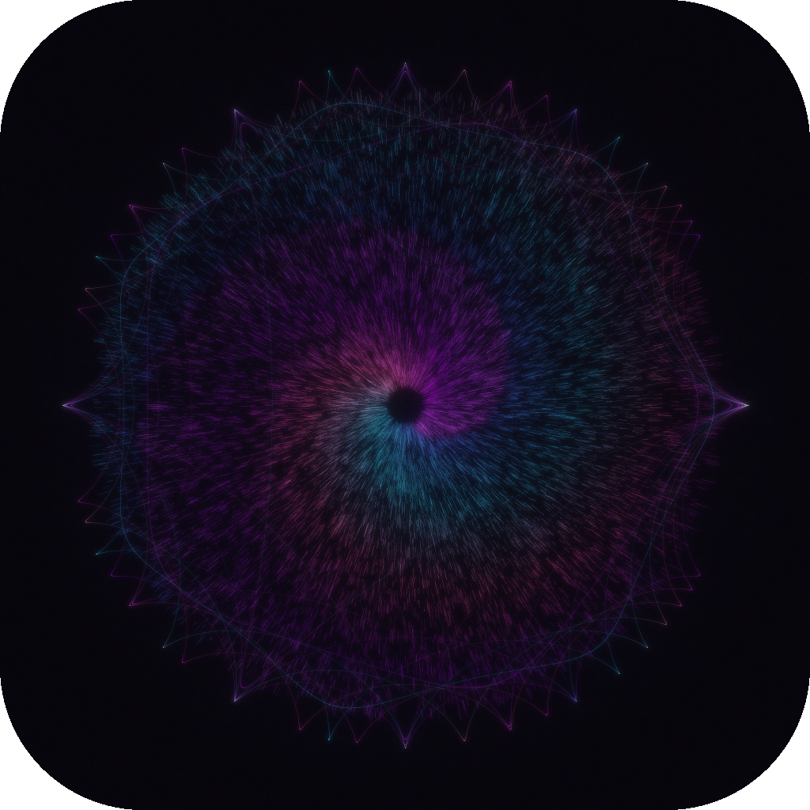

# Mandala Generator

A native macOS app for generating neon light-painting mandala images. Every parameter is controllable in real time, with instant auto-generation on change.



## Features

- **10 drawing styles** — Spirograph, Rose Curves, String Art, Sunburst, Epitrochoid, Floral, Lissajous, Butterfly, Geometric, Mixed
- **Multi-layer compositing** — stack up to 5 independent layers, each with its own style, palette, and settings
- **Per-layer controls** — symmetry, seed, scale, complexity, density, glow, colour drift, ripple, wash, abstract level, saturation, brightness
- **18 colour palettes** — Aurora, Nebula, Neon City, Sunset, Prism, Bioluminescence, Dragon, Synthwave, Lava, and more
- **Randomize All** — generates a completely new random mandala in one click
- **Export** — PNG or JPG at 512 / 800 / 1024 / 1400 / 2048 px
- **Batch export** — render many variations to a folder in parallel
- **Pan & zoom** — scroll to zoom, drag to pan the canvas preview

## Building

Requires Xcode command-line tools and Swift 5.9+.

```bash
swift build -c release
./build_app.sh
open "Mandala Generator.app"
```

## Interface

```
┌─────────────────────────────────────────────────┐
│  Generate   Randomize All   Save   800 px   PNG  │  ← toolbar
├──────────────────────────┬──────────────────────┤
│                          │  LAYERS              │
│                          │  ┌────────────────┐  │
│       Canvas             │  │ Layer 1        │  │
│   (pan + zoom)           │  │  symmetry/seed │  │
│                          │  │  sliders…      │  │
│                          │  └────────────────┘  │
│                          │  ┌────────────────┐  │
│                          │  │ Layer 2        │  │
│                          │  └────────────────┘  │
└──────────────────────────┴──────────────────────┘
```

### Toolbar

| Control | Description |
|---|---|
| **Generate** (⌘R) | Re-render with current settings |
| **Randomize All** | Randomise all layers and settings |
| **Save** | Save the current image |
| **Size picker** | Output resolution (512–2048 px) |
| **Format picker** | PNG or JPG |

### Layer Card

Each layer is an independent drawing pass composited on top of the previous layers using screen blending.

| Parameter | Effect |
|---|---|
| **Symmetry** | Rotational repeat count (1–8) |
| **Seed** | RNG seed — change for a different curve arrangement |
| **Scale** | Radius of the pattern (0.1–1.0) |
| **Complexity** | Number of curves drawn |
| **Density** | Stroke weight and line count |
| **Glow** | Bloom/glow halo intensity |
| **Color Drift** | How far colours shift along the palette per curve |
| **Ripple** | Radial displacement noise |
| **Wash** | Watercolour bleed overlay |
| **Abstract** | Turbulence distortion + painted blur |
| **Saturation** | Colour vividness for this layer |
| **Brightness** | Luminance boost for this layer |

## Architecture

| File | Purpose |
|---|---|
| `MandalaParameters.swift` | `StyleLayer` and `MandalaParameters` model structs |
| `MandalaRenderer.swift` | Core renderer — curve generation, per-layer compositing, CIFilter post-processing |
| `PixelBuffer.swift` | Float32 additive pixel buffer with Wu anti-aliased line drawing |
| `ColorPalettes.swift` | 18 named colour palettes |
| `AppState.swift` | `@MainActor ObservableObject` — debounced auto-generate, save, batch export |
| `ContentView.swift` | Root layout (HSplitView: canvas + layers panel) |
| `CanvasView.swift` | Canvas with pan/zoom, toolbar, context menu |
| `PalettePanel.swift` | Layers panel — expandable `LayerCard` views |
| `ParameterPanel.swift` | Shared UI components (`PaletteSwatch`, `SectionCard`, etc.) |

### Rendering pipeline

1. **Background** — radial gradient tinted with the first layer's palette
2. **Grass fibers** — fine ambient lines from the first layer's seed
3. **Per layer** — curves collected into `CurveDrawTask` structs, drawn in parallel via `DispatchQueue.concurrentPerform` into per-thread sub-buffers, merged with `vDSP_vadd`, then glow → wash → abstract → colour grade applied
4. **Screen composite** — each layer blended onto the running composite
5. **Downscale** — Lanczos downscale from 2× render buffer to output size
